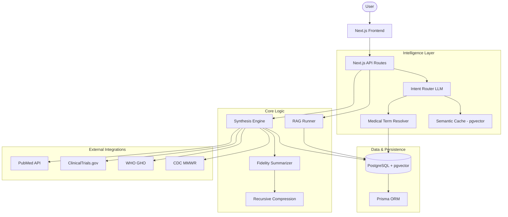

# Medical 360: Architecture

The Medical 360 architecture is designed for high-fidelity data retrieval and intelligent synthesis. It bridges the gap between raw scientific research and strategic medical insights across a broad range of medical terms, including pathogens, drugs, diseases, and molecules.

## System Architecture Diagram

## Component Breakdown

### 1. Intelligence Layer (Routing & Resolution)

- **Intent Router**: Uses a specialized LLM prompt to classify user queries into routes (Single Medical Term, Family/Category, General Portfolio, etc.).
- **Medical Term Resolver**: A multi-stage resolution engine that maps user input to canonical names using vector similarity (`pgvector`) and alias registries.
- **Semantic Cache**: Reduces latency by retrieving previously generated answers for similar queries using vector distance thresholds.

### 2. Synthesis Engine

- **Temporal Fidelity Summarizer**: Re-synthesis logic for ensuring intelligence remains current with the underlying data cluster. Implements "Temporal Fidelity" where research from the last 24 months is summarized in high detail, 24-60 months in balanced detail, and older research in aggressive/brief summaries.
- **Incremental Synthesis**: Performs "Narrative Merges" of new findings into existing Knowledge Nuclei, using a high-capacity context (15,000 tokens) to ensure deep coverage.
- **Logical Inquiry (Deep Dive)**: Asynchronous intelligence generation for specific researcher inquiries, powered by the Knowledge Nucleus and background `Operations`.
- **Recursive Compression**: For terms with massive amounts of research, the system recursively compresses intermediate summaries into a single "Thematic Trend Overview" before final nucleus generation.

### 3. Data & Communication Layer

- **Knowledge Chunks**: Raw data is chunked and embedded into a vector space for granular retrieval during chat (RAG).
- **Consolidated Metadata**: Prisma handles complex relationships between Medical Terms, Articles, Trials, and Epidemiology Metrics.
- **Global Notification Fabric**: Real-time polling and alerting system for background task completion, providing a seamless asynchronous research experience.
