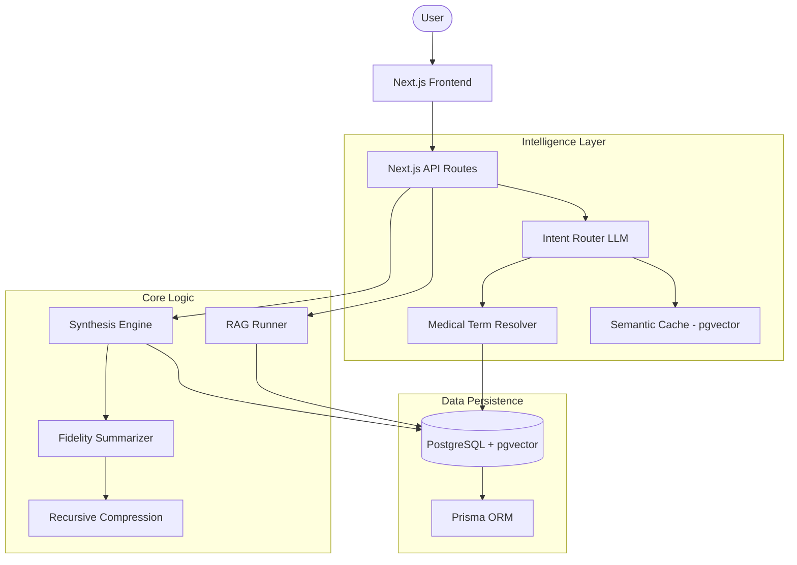

# Medical 360: Comprehensive Documentation

Welcome to the comprehensive documentation for **Medical 360**, the advanced intelligence platform for medical research, clinical analysis, and pharmaceutical strategy.

---

## Table of Contents

1. [System Overview & Features](#system-overview--features)
2. [Core Architecture](#core-architecture)
3. [Logic Pathways](#logic-pathways)
4. [Data Schema & External Integrations](#data-schema--external-integrations)

---

## System Overview & Features

Medical 360 provides a "360-degree view" of medical research by synthesizing data from scientific literature, clinical registries, and global health surveillance systems.

### Core Features

- **Semantic Medical Term Resolution**: Resolves natural language queries (e.g., "metformin", "SARS2") to canonical entities using vector and regex matching.
- **Deep-Dive Research Inquiries**: The platform identifies key investigative focus areas and allows you to trigger on-demand, deep-dive answers. These answers are generated asynchronously, allowing you to continue your research without interruption.
- **Global Notification Fabric**: A real-time alerting system that notifies you the moment a deep-dive analysis is complete, providing a direct link to the new intelligence.
- **High-Capacity Synthesis**: Knowledge Nuclei are synthesized using up to 15,000 tokens of context, ensuring every critical clinical detail is captured and reconciled.
- **High-Fidelity Research Reports**: Export your findings into beautifully formatted PDFs that include the core Knowledge Nucleus and all addressed Research Inquiries.
- **Intelligent Knowledge Nucleus**: A deep-synthesis engine for high-density medical intelligence.
- **Temporal Fidelity Intelligence**: Prioritizes recent literature (< 24mo) for up-to-the-minute clinical relevance.
- **Incremental Knowledge Merging**: Automatically updates existing reports with new findings without losing historical context.
- **Multi-Modal Research Chat**: RAG-powered chat with intelligent intent routing between fast-cache and deep-search modes.
- **Automated Research Intelligence**: Generates technical PDF reports detailing clinical pipelines and strategic insights.

---

## Core Architecture

Medical 360 uses a distributed architecture to bridge raw data and strategic insights.

### Architecture Diagram

---

## Logic Pathways

### 1. Medical Term Resolution

Maps user input to canonical names using exact, regex, and vector similarity (`pgvector`). This captures complex aliases and synonyms in medical terminology.

### 2. Intent Routing

Every query passes through an LLM "Router" to determine the most accurate context (Single Medical Term, Category/Family, or General Portfolio).

### 3. Knowledge Synthesis

- **Temporal Fidelity**: Higher detail for recent research (< 24mo) and clinical trials using chunked LLM summarization.
- **Incremental Merge**: Performs a narrative merge of new ingestion results into the existing Nucleus using a high-capacity 15,000-token context.
- **Recursive Compression**: Aggregates hundreds of batches into a single thematic trend overview.
- **Investigation Answering**: Automatically addresses the 25 logical questions identified during ingestion using the synthesized nucleus.

### 4. RAG (Retrieval-Augmented Generation) & Chat Agent

- **Intent Routing**: Classifies queries into Single Term, Category, or Global routes to optimize context retrieval.
- **Dynamic Context**: Assembles the Knowledge Nucleus + granular vector-searched chunks (KnowledgeChunks) to provide cited, accurate answers.
- **Self-Correction**: Enforces strict grounding rules to ensure the agent only speaks from the provided medical context.

---

## Data Schema & External Integrations

### Data Model

- **Core Entities**: MedicalTerm, Article (PubMed), ClinicalTrial (CT.gov), MedicalMetric (WHO), SurveillanceAlert (CDC).
- **Vector Storage**: KnowledgeChunks and MedicalTermEmbeddings for semantic search.

### External Sources

- **PubMed**: Scientific research foundation (abstracts and metadata).
- **ClinicalTrials.gov**: Development pipeline monitoring and trial protocols.
- **WHO GHO**: Global epidemiological and health statistics.
- **CDC MMWR**: Real-time outbreak and surveillance updates.

---

*This documentation is maintained by Antigravity AI.*
