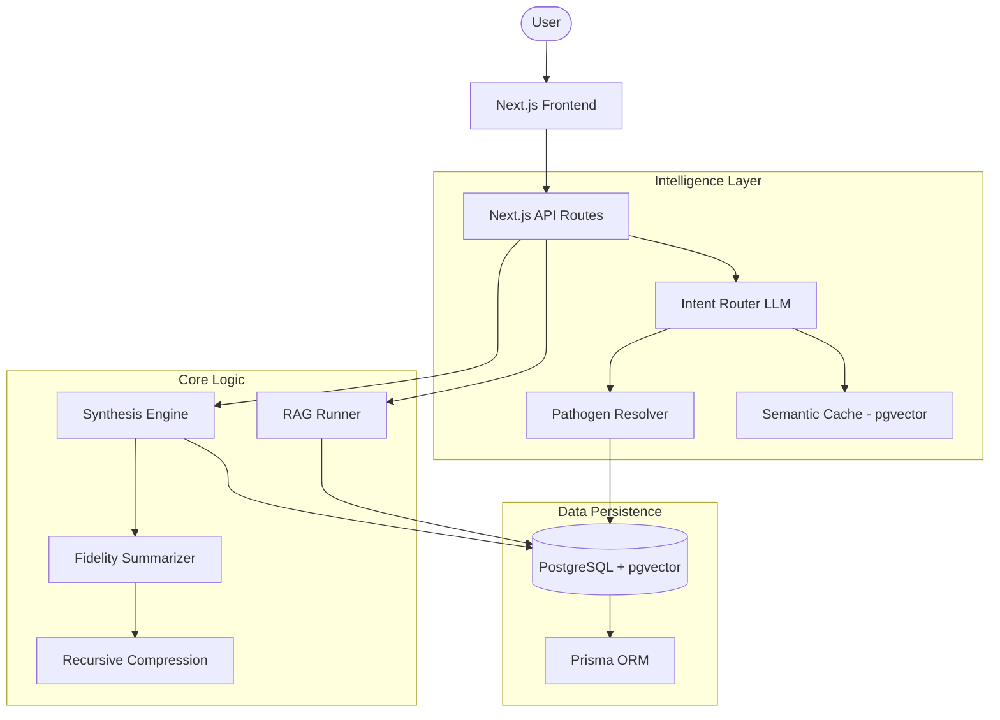

# Pathogen 360: Comprehensive Documentation

Welcome to the comprehensive documentation for **Pathogen 360**, the advanced intelligence platform for pharmaceutical research and public health analysis.

---

## Table of Contents
1. [System Overview & Features](#system-overview--features)
2. [Core Architecture](#core-architecture)
3. [Logic Pathways](#logic-pathways)
4. [Data Schema & External Integrations](#data-schema--external-integrations)

---

## System Overview & Features

Pathogen 360 provides a "360-degree view" of viral and bacterial threats by synthesizing data from scientific literature, clinical registries, and global surveillance systems.

### Core Features
- **Semantic Pathogen Resolution**: Resolves natural language queries (e.g., "SARS2") to canonical entities.
- **Intelligent Knowledge Nucleus**: Deep-synthesis engine for high-density pathogen intelligence.
- **Multi-Modal Research Chat**: RAG-powered chat with intelligent intent routing.
- **Automated Market Intelligence**: PDF reports detailing pipelines and investment gaps.
- **Portfolio Analytics**: Aggregated insights across all tracked pathogens.

---

## Core Architecture

Pathogen 360 uses a distributed architecture to bridge raw data and strategic insights.

### Architecture Diagram

---

## Logic Pathways

### 1. Pathogen Resolution
Maps user input to canonical names using exact, regex, and vector similarity (`pgvector`). This captures aliases (e.g., "the flu" -> "Influenza A virus").

### 2. Intent Routing
Every query passes through an LLM "Router" to determine the most accurate context (Single Pathogen, Family, or General Portfolio).

### 3. Knowledge Synthesis
- **Temporal Fidelity**: Higher detail for recent research (< 24mo).
- **Recursive Compression**: Aggregates hundreds of batches into a single thematic trend overview.

### 4. RAG (Retrieval-Augmented Generation)
Assembles a dynamic context of the Knowledge Nucleus + granular vector-searched chunks to provide cited, accurate answers.

---

## Data Schema & External Integrations

### Data Model
- **Core Entities**: Pathogens, Articles (PubMed), ClinicalTrials (CT.gov), EpidemiologyMetrics (WHO).
- **Vector Storage**: KnowledgeChunks and PathogenNameEmbeddings for semantic search.

### External Sources
- **PubMed**: Scientific research foundation.
- **ClinicalTrials.gov**: Development pipeline monitoring.
- **WHO GHO**: Global epidemiological statistics.
- **CDC MMWR**: Real-time outbreak surveillance.

---

*This documentation is maintained by Antigravity AI.*
